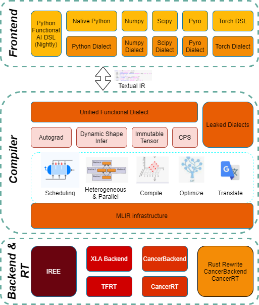
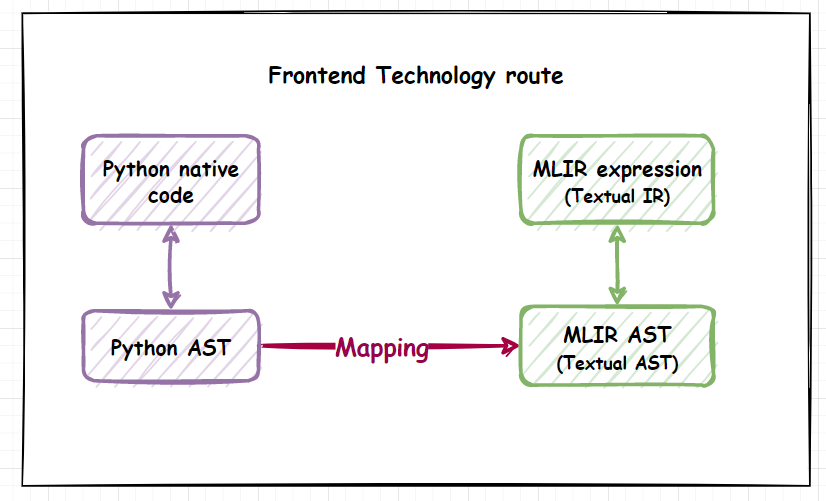

<div align=center>


</div>

# Introduction: Composite AI Compiler Experiment Platform

The Composite AI Compiler Experiment Platform (Cancer) built with composite modularized frontend, midware and runtime backend. It builds with more flexible ways that allows you register new breed of frontend/backend implementations and compare with each other. It also relies on MLIR to provide fruitful manifolds and toolchains that allows you play with the IR design of the compiler part, the architecture is shown below.
<div align=center>


</div>

This is an example of an out-of-tree [MLIR](https://mlir.llvm.org/) dialect along with a standalone `opt`-like tool to operate on that dialect.

This projects also refers to the idea and implementations of some similar works, including:

1. mlir-npcomp: https://github.com/google/mlir-npcomp
2. Jax: https://github.com/google/jax
3. Swift for Tensorflow: https://github.com/tensorflow/swift
4. MLIR.jl: https://github.com/vchuravy/MLIR.jl


## Build Cancer

It support the a simple `python-like` installation with setuptools. This will install the standalone python modules into your OS envs.

To ensure that the entire project builds successfully, you need to make sure that the particular dependency version is installed correctly in advance, version requirements are available [here](https://llvm.org/docs/GettingStarted.html#requirements). Of course, you can also use clang & clang++(chosen and version is 11.1.0+) as the compiler instead of gcc/g++.

For convenience, there is a script that automatically installs the LLVM nightly toolchain packages on the different Debian and Ubuntu versions (refer [here](https://apt.llvm.org/)). If you want to install a sepcific version of LLVM, for example, install version 11 as follow
```sh
wget https://apt.llvm.org/llvm.sh
chmod +x llvm.sh
sudo ./llvm.sh 11
```
After ensuring that all of the environment dependencies are ready, let's start building the project as follows

<font color=Blue>**STEP1**</font> The project depends on three externals included that llvm-project, pybind11 and pymlir, so them must be cloned firstly as follow.
```sh
git submodule init
git submodule update
```
After cloning is complete, llvm-project, pybind11 and pymlir will appear in the external directory.

<font color=Blue>**STEP2**</font> Build the Cancer, in order to build project successfully, the LLVM+MLIR must be build successfully first, here provide the complete build script as follow.
```shell
cd Cancer/
bash script/build_and_install.sh
```

After build successfully, please check contents as follow.

- There executable binaries that included `cancer-opt`/`cancer-translate`/`cancer-compiler-runmlir`will be successfully generated in `Cancer/build/bin/` directory;

- The static library named `cancer-compiler-runmlir-capi` will be successfully generated in `Cancer/build/lib/` directory;

- The `mlir-doc` documentation that according to `.td` table declarations will be successfully generated in `Cancer/build/docs` directory.

<!-- * use `scripts/build_python_pkg.sh` to build the python wheel distribution package. -->

More detailly, build **LLVM + MLIR** and **Cancer** seperately as shown below.

### Build LLVM + MLIR
If not familiar with building MLIR based on LLVM, please refer [here](https://mlir.llvm.org/getting_started/). Now build LLVM + MLIR as follow.
```sh
# top_dir_realpath="path/to/Cancer"
mkdir ${top_dir_realpath}/mlir_build
cd ${top_dir_realpath}/mlir_build
mkdir -p ${top_dir_realpath}/mlir_build/install_dir

cmake -G Ninja \
    ${top_dir_realpath}/external/llvm-project/llvm \
    -DLLVM_ENABLE_PROJECTS=mlir \
    -DLLVM_BUILD_EXAMPLES=ON \
    -DLLVM_TARGETS_TO_BUILD="X86" \
    -DCMAKE_BUILD_TYPE=RELEASE \
    -DLLVM_ENABLE_ASSERTIONS=ON \
    -DCMAKE_C_COMPILER=clang-11 \
    -DCMAKE_CXX_COMPILER=clang++-11 \
    -DCMAKE_INSTALL_PREFIX=${top_dir_realpath}/mlir_build/install_dir \
    -DLLVM_INSTALL_UTILS=ON \
    -DLLVM_BUILD_LLVM_DYLIB=ON \
    -DLLVM_LINK_LLVM_DYLIB=ON
```
<font color=Red>**Notice**</font>: 
- Have to make sure build successfully, that is built LLVM + MLIR in `$BUILD_DIR=${top_dir_realpath}/mlir_build` and installed them to `$PREFIX=${top_dir_realpath}/mlir_build/install_dir`;

- Make sure to pass `-DLLVM_INSTALL_UTILS=ON` when building LLVM with CMake in order to install `FileCheck` to the chosen installation prefix.
More easily, use `pip install filecheck && ln -s ${which filecheck} /usr/bin/FileCheck` to given the executable path of filecheck to cmake.

### Build Cancer
The prerequisite for a successful Cancer build is to ensure the successful LLVM + MLIR build. This setup assumes that you have built LLVM and MLIR in `$BUILD_DIR` and installed them to `$PREFIX`. To build Cancer as follow.
```sh
mkdir build && cd build
cmake -G Ninja .. -DMLIR_DIR=$PREFIX/lib/cmake/mlir -DLLVM_EXTERNAL_LIT=$BUILD_DIR/bin/llvm-lit -DCMAKE_BUILD_TYPE=DEBUG
cmake --build . --target <cancer-runner/cancer-opt/cancer-translate>
```

To build the documentation from the TableGen description of the dialect operations, please run
```sh
cmake --build . --target mlir-doc
```

## Cancer Frontend
Cancer is a multi-frontend design with preferred support for `native python` and `numpy+scipy`, And strive to design the frontend as uniformly functional expression as possible. The **Frontend Technology Route** is shown below.
<div align=center>


</div>

Let's try using `native python` firstly to implement front-end functionality, as follow.

<font color=Blue>**STEP1**</font>: Build and install python package
```sh
cd Cancer/
bash scripts/_build_python_package.sh
bash scripts/_install_python_package.sh
```
After install python package successfully, can run the following script to test frontend functionality.
```sh
bash scripts/python_test.sh
```
More detailly, For given a simple python code:
```python
def constant3() -> float:
    var1 = 1.0
    return var1
```
And the corresponding python native [AST](https://docs.python.org/3/library/ast.html) is
```python
Module(
  body=[FunctionDef(
    name='constant3',
    args=arguments(
      posonlyargs=[],
      args=[],
      vararg=None,
      kwonlyargs=[],
      kw_defaults=[],
      kwarg=None,
      defaults=[]),
    body=[
      Assign(
        targets=[Name(
          id='var1',
          ctx=Store())],
        value=Constant(
          value=1.0,
          kind=None),
        type_comment=None),
      Return(value=Name(
        id='var1',
        ctx=Load()))],
    decorator_list=[],
    returns=Name(
      id='float',
      ctx=Load()),
    type_comment=None)],
  type_ignores=[])
```
Ok, Now we constructs the [MLIR AST](https://github.com/llvm/llvm-project/blob/5b4a01d4a63cb66ab981e52548f940813393bf42/mlir/docs/LangRef.md) via above python native AST, format as follow.
```python
MLIRFile(
  definitions=[],
  modules=[
    Module(
      name=None,
      attributes=None,
      region=Region(
        body=[
          Block(
            label=None,
            body=[
              Operation(
                result_list=[],
                op=Function(
                  name=SymbolRefId(
                    value='constant3'),
                  args=None,
                  result_types=None,
                  attributes=None,
                  region=Region(
                    body=[
                      Block(
                        label=None,
                        body=[
                          Operation(
                            result_list=[
                              OpResult(
                                value=SsaId(
                                  value='var1',
                                  op_no=None),
                                count=None)],
                            op=ConstantOperation(
                              match=0,
                              value=1.0,
                              type=FloatType(
                                type=<FloatTypeEnum.f32:'f32'>)),
                            location=None),
                          Operation(
                            result_list=None,
                            op=ReturnOperation(
                              match=1,
                              values=[
                                SsaId(
                                  value='var1',
                                  op_no=None)],
                              types=[
                                FloatType(
                                  type=<FloatTypeEnum.f32:'f32'>)]),
                            location=None)])]),
                  location=None),
                location=None)])]),
      location=None)])
```
And the corresponding MLIR is
```python
func @constant3() {
  %var1 = constant 1.0 : f32
  return %var1 : f32
}
```
